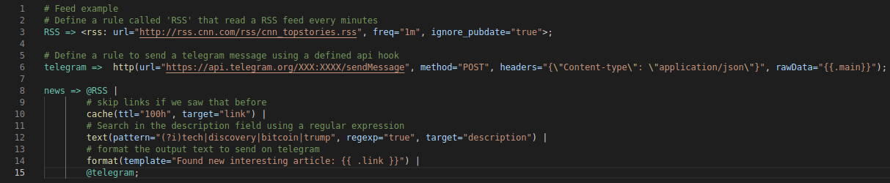

# Driplane's Rule Syntax Highlight 

This extension adds the syntax highlight support for the Driplane's rule files on VSCode. 
Driplane project can be found on https://github.com/Matrix86/driplane.

Link to this extension on the Marketplace https://marketplace.visualstudio.com/items?itemName=Matrix86.driplane

  

## Package building

If you want to change and create the package by yourself to test it locally, you can install Node.js and then `vsce`:

> npm install -g vsce

To build the vsix package:

> vsce package

To install it from file:
> code --install-extension driplane-version.vsix